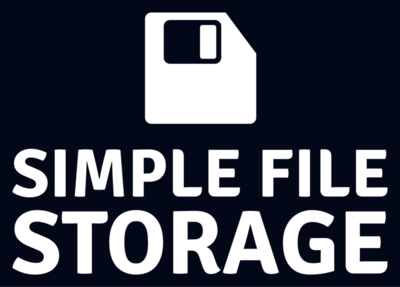
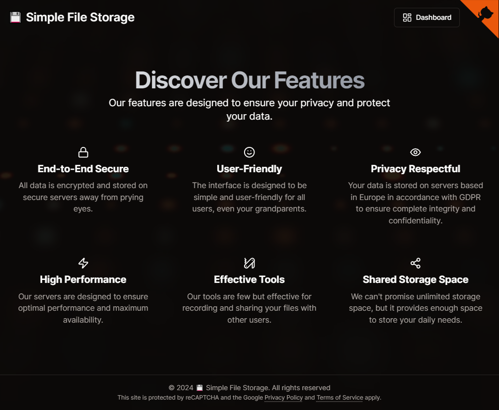

# 💾 Simple File Storage

## In French

Débuté en septembre 2023 et après 8 mois de développement intensif, je suis fier de présenter un projet qui me tient particulièrement à cœur. Ce projet est un
gestionnaire de fichiers simple et efficace, permettant de stocker des fichiers sur un serveur distant. Ce projet a été réalisé après la fin de mes études et durant mon temps libre. Le temps de développement a été bien plus long que mon dernier gros projet [*Source Web Console*](https://github.com/FlorianLeChat/Source-Web-Console) mais le résultat est là.

Ce projet a été conçu initialement dans le but d'exploiter les dernières technologies et outils à la mode dans l'écosystème JavaScript. Malgré tout, je suis assez déçu de leur utilisation et de leur performance durant la période de développement, je ne compte plus le nombre de problèmes que j'ai pu rencontrer avec les dernières versions de [NextJS](https://nextjs.org/), [Prisma](https://www.prisma.io/) ou encore [Next Auth](https://authjs.dev/). C'est pourquoi, je vous déconseille d'utiliser ces technologies pour un projet de production, préférez des technologies plus stables et éprouvées quitte à sortir de l'écosystème JavaScript (comme [Symfony](https://symfony.com/) par exemple).

Au niveau des fonctionnalités, ce projet vous permet de stocker des fichiers sur un serveur distant, de les télécharger, de les supprimer et de les partager. Vous pouvez également créer un compte utilisateur pour accéder à vos fichiers depuis n'importe où. Ce projet est également responsive et s'adapte à tous les écrans. De plus, il offre de nombreuses options de personnalisation pour les utilisateurs et il est respectueux des normes de confidentialité liées au RGPD.

> [!TIP]
> Voir le fichier [SETUP.md](https://github.com/FlorianLeChat/Simple-File-Storage/blob/master/SETUP.md) pour consulter les instructions d'installation.
>
> Si vous êtes à la recherche de la première version sous PHP, veuillez utiliser la branche `no-nextjs`. 🐘

> [!IMPORTANT]
> L'entièreté du code de ce projet est commenté dans ma langue natale (en français) et n'est pas voué à être traduit en anglais par soucis de simplicité de développement.

## In English

Started in September 2023 and after 8 months of intensive development, I am proud to present a project that is particularly close to my heart. This project is a simple and efficient file manager, allowing you to store files on a remote server. This project was carried out after the end of my studies and during my free time. The development time was much longer than my last big project [*Source Web Console*](https://github.com/FlorianLeChat/Source-Web-Console) but the result is there.

This project was initially designed to exploit the latest technologies and trendy tools in the JavaScript ecosystem. However, I am quite disappointed with their use and performance during the development stage, I can no longer count the number of issues I encountered with the latest versions of [NextJS](https://nextjs.org/), [Prisma](https://www.prisma.io/) or [Next Auth](https://authjs.dev/). That's why I advise you not to use these technologies for a production project, prefer more stable and proven technologies even if it means leaving the JavaScript ecosystem (like [Symfony](https://symfony.com/) for example).

In terms of features, this project allows you to store files on a remote server, download them, delete them and share them. You can also create a user account to access your files from anywhere. This project is also responsive and adapts to all screens. In addition, it offers many customization options for users and is respectful of privacy standards related to the GDPR.

> [!TIP]
> See the [SETUP.md](https://github.com/FlorianLeChat/Simple-File-Storage/blob/master/SETUP.md) file for setup instructions.
>
> If you are looking for the first version under PHP, please use the `no-nextjs` branch. 🐘

> [!IMPORTANT]
> The whole code of this project is commented in my native language (in French) and will not be translated in English for easier programming.

